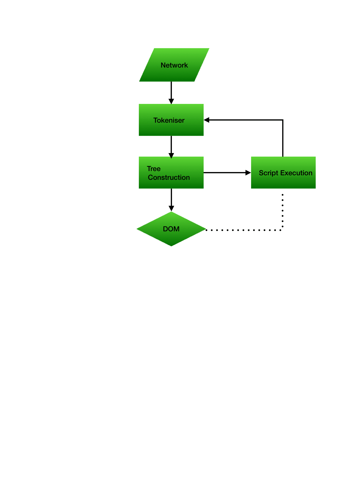

## When a user enters an URL in the browser, how does the browser fetch the desired result ?


**Parsing HTML**

- HTML is forgiving by nature
- Parsing isn’t straight forward
- Can be halted
- Will do speculative parsing
- It’s reentrant



**Tokensiser → tag parsing → <div> (start tag), </div>(end tag)**

**Parse tree → DOM Tree**

```js
<script>, <link> & <style>
```

Will halt the parser as a script can alter the document

→ Network latency

→ link and style could halt the JS execution

### **Components of a Web Browser**

- **User Interface:** It is an environment allowing users to use certain features like search bar, refresh button, menu, bookmarks, etc.
- **Browser Engine:** The bridge connects the interface and the engine. It monitors the rendition engine while manipulating the inputs coming from multiple user interfaces.
- **Networking:** The protocol provides an URL and manages all sorts of safety, privacy and communication. In addition, the store network traffic gets saved in retrieved documents.
- **Data Storage:** The cookies store information as the data store is an uniform layer that the browsers use. Storage processes like IndexedDB, WebSQL, localStorage, etc works well on browsers.
- **JavaScript Interpreter:** It allows conversion of JavaScript code in a document and the executes it. Then the engine shows the translation on the screen to the users.

### Order of execution

- **`<script>` in `<head>`:** VeryHigh - Blocks parser
- **`<link rel=preload> + <script async> hack or <script type=module async>`:** High - Interrupts parser
- **`<script async>`:** High - Interrupts parser
- **`<script> at the end of <body>`:** Low - Waits parser end
- **`<script defer>`:** VeryLow - Runs after `<script>`s at end of `<body`
- **`<script defer>` at the end of `<body>`:** VeryLow - Runs after `<script>`s at end of `<body>`
- **`<link rel=prefetch>` + `<script>` in a next-page navigation`:** Depends on when and how the script is consumed.

### **[Layout](https://developer.mozilla.org/en-US/docs/Web/Performance/How_browsers_work#layout)**

The fourth step in the critical rendering path is running layout on the render tree to compute the geometry of each node. *Layout* is the process by which the width, height, and location of all the nodes in the render tree are determined, plus the determination of the size and position of each object on the page. *Reflow* is any subsequent size and position determination of any part of the page or the entire document.

Once the render tree is built, layout commences. The render tree identified which nodes are displayed (even if invisible) along with their computed styles, but not the dimensions or location of each node. To determine the exact size and location of each object, the browser starts at the root of the render tree and traverses it.

On the web page, almost everything is a box. Different devices and different desktop preferences mean an unlimited number of differing viewport sizes. In this phase, taking the viewport size into consideration, the browser determines what the dimensions of all the different boxes are going to be on the screen. Taking the size of the viewport as its base, layout generally starts with the body, laying out the dimensions of all the body's descendants, with each element's box model properties, providing placeholder space for replaced elements it doesn't know the dimensions of, such as our image.

The first time the size and position of nodes are determined is called *layout*. Subsequent recalculations of node size and locations are called *reflows*. In our example, suppose the initial layout occurs before the image is returned. Since we didn't declare the size of our image, there will be a reflow once the image size is known.

### **[Paint](https://developer.mozilla.org/en-US/docs/Web/Performance/How_browsers_work#paint)**

The last step in the critical rendering path is painting the individual nodes to the screen, the first occurrence of which is called the first meaningful paint. In the painting or rasterization phase, the browser converts each box calculated in the layout phase to actual pixels on the screen. Painting involves drawing every visual part of an element to the screen, including text, colors, borders, shadows, and replaced elements like buttons and images. The browser needs to do this super quickly.

To ensure smooth scrolling and animation, everything occupying the main thread, including calculating styles, along with reflow and paint, must take the browser less than 16.67ms to accomplish. At 2048 X 1536, the iPad has over 3,145,000 pixels to be painted to the screen. That is a lot of pixels that have to be painted very quickly. To ensure repainting can be done even faster than the initial paint, the drawing to the screen is generally broken down into several layers. If this occurs, then compositing is necessary.

Painting can break the elements in the layout tree into layers. Promoting content into layers on the GPU (instead of the main thread on the CPU) improves paint and repaint performance. There are specific properties and elements that instantiate a layer, including `<video>` and `<canvas>`, and any element which has the CSS properties of `opacity`, a 3D `transform`, `will-change`, and a few others. These nodes will be painted onto their own layer, along with their descendants, unless a descendant necessitates its own layer for one (or more) of the above reasons.

Layers do improve performance, but are expensive when it comes to memory management, so should not be overused as part of web performance optimization strategies.
